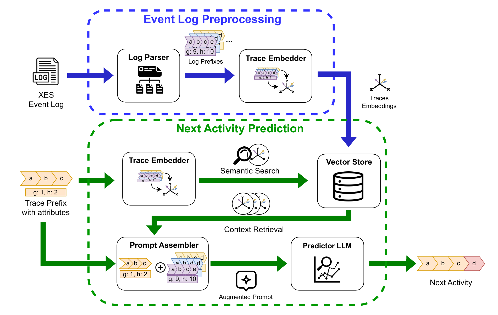

# Enhancing Next Activity Prediction in Process Mining with Retrieval-Augmented Generation

This repository contains the code and data to reproduce the experiments from the paper _"Enhancing Next Activity Prediction in Process Mining with Retrieval-Augmented Generation"_.

## About

Next activity prediction is one of the main tasks of Predictive Process Monitoring (PPM), enabling organizations to forecast the execution of business processes and respond accordingly. Deep learning models are strong for predictions, but with the price of intensive training and feature engineering, rendering them less generalizable across domains. Large Language Models (LLMs) have been recently suggested as an alternative, but their capabilities in process mining tasks are still to be extensively investigated.
This work introduces a framework leveraging LLMs and Retrieval-Augmented Generation to enhance their capabilities for predicting next activities. By leveraging sequential information and data attributes from past execution traces, our framework enables LLMs to make more accurate predictions without requiring additional training. We conduct a comprehensive analysis on a range of real-world event logs and compare our method with other state-of-the-art approaches. Findings show that our framework achieves competitive performance while being more adaptable across domains.
Despite these advantages, we also report the limitations of the framework, mainly referred to interleaving activity sensitivity and concept drifts. Our findings highlight the potential of retrieval-augmented LLMs in PPM while identifying the need for future research into handling evolving process behaviors and the development of standard benchmarks.

## Architecture



The Figure shows the components of the framework and how they interact.

The framework can be decomposed into two main parts:
- _Event Log Preprocessing_, which happens offline, takes the XES event log in input and is responsible for its parsing to extract the formatted prefix traces and their storing as embeddings in a vector index; and 
- _Next Activity Prediction_, which happens online, receives as input the trace prefix over which performing the prediction of the next activity and it uses it to retrieve relevant past prefix traces from the vector store to leverage them for returning the prediction of the next activity.

## Structure of the repository

```
.
├── src               # source code of proposed framework
|   ├── main.py       # main script for live prompting mode
|   ├── eval.py       # evaluation script for batch testing
|   ├── pipeline.py   # RAG pipeline implementation
|   ├── oracle.py     # verification oracle
|   └── ...
├── tests             # sources for evaluation
|   ├── outputs       # outputs of the live convesations
|   ├── test_sets     # test sets employed during the evaluation
|   └── validation    # evaluation results for each run
├── logs.zip          # zipped folder with the tested log (to unzip)
|   └──...
└──...
```

## Getting Started

First, you need to clone the repository:
```bash
git clone https://github.com/angelo-casciani/rag_next_activity
cd rag_next_activity
```

Create a new [conda](https://docs.anaconda.com/free/miniconda/) environment:
```bash
conda create -n rag_next_activity python=3.10 --yes
conda activate rag_next_activity
```

Run the following command to install the necessary packages along with their dependencies in the `requirements.txt` file using `pip`:
```bash
pip install -r requirements.txt
```

Set up a [HuggingFace token](https://huggingface.co/) and/or an [OpenAI API key](https://platform.openai.com/overview) in the `.env` file in the root directory, along with the URL and the GRPC port where the qDrant client is listening on the host:
    ```env
    HF_TOKEN=<your token, should start with hf_>
    OPENAI_API_KEY=<your key, should start with sk->
    QDRANT_URL=<qDrant client url>
    QDRANT_GRPC_PORT=<qDrant client grpc port>
    ```

Unzip the *logs.zip* directory:
```bash
unzip logs.zip
```

This project uses [Docker](https://www.docker.com/) to run the vector store [Qdrant](https://qdrant.tech/).

Ensure Docker is installed and running on your system.

First, download the latest Qdrant image from Dockerhub:
```bash
docker pull qdrant/qdrant
```

Then, run the service:
```bash
docker run -p 6333:6333 -p 6334:6334 \
    -v "$(pwd)/qdrant_storage:/qdrant/storage:z" \
    qdrant/qdrant
```

## LLMs Requirements

Please note that this software leverages open-source LLMs reported in the table:

| Model | HuggingFace Link |
|-----------|-----------|
| meta-llama/Meta-Llama-3.1-8B-Instruct | [HF link](https://huggingface.co/meta-llama/Meta-Llama-3.1-8B-Instruct) |
| meta-llama/Llama-3.2-1B-Instruct | [HF Link](https://huggingface.co/meta-llama/Llama-3.2-1B-Instruct)|
| meta-llama/Llama-3.2-3B-Instruct | [HF link](https://huggingface.co/meta-llama/Llama-3.2-3B-Instruct) |
| mistralai/Mistral-7B-Instruct-v0.2 | [HF link](https://huggingface.co/mistralai/Mistral-7B-Instruct-v0.2) |
| mistralai/Mistral-7B-Instruct-v0.3 | [HF link](https://huggingface.co/mistralai/Mistral-7B-Instruct-v0.3) |
| Qwen/Qwen2.5-7B-Instruct | [HF link](https://huggingface.co/Qwen/Qwen2.5-7B-Instruct) |
| microsoft/phi-4 | [HF link](https://huggingface.co/microsoft/phi-4) |
| gpt-4o-mini | [OpenAI link](https://platform.openai.com/docs/models) |
| deepseek-ai/DeepSeek-R1-Distill-Qwen-7B | [HF link](https://huggingface.co/deepseek-ai/DeepSeek-R1-Distill-Qwen-7B) |
| deepseek-ai/DeepSeek-R1-Distill-Llama-8B | [HF link](https://huggingface.co/deepseek-ai/DeepSeek-R1-Distill-Llama-8B) |

Request in advance the permission to use each Llama model for your HuggingFace account.
Retrive your OpenAI API key to use the supported GPT model.

Please note that each of the selected models have specific requirements in terms of GPU availability.
It is recommended to have access to a GPU-enabled environment meeting at least the minimum requirements for these models to run the software effectively.

## Usage

The framework provides two modes of operation:

### Live Prompting Mode

Run the framework for interactive next activity prediction:
```bash
cd src
python3 main.py
```

The interactions will be stored in a `.txt` file in the [outputs](tests/outputs) folder.

### Evaluation Mode

Run the framework for batch evaluation using test sets:
```bash
cd src
python3 eval.py
```

This will evaluate the model's performance on predefined test sets and generate validation results.

### Earlyness Analysis

The evaluation system includes **earlyness analysis** to evaluate the model's early prediction capability across different prefix lengths. This feature provides insights into temporal aspects of next activity prediction.

#### Key Features
- **Tracks prefix lengths** for each prediction automatically
- **Groups results by configurable prefix length buckets** (earlyness buckets)
- **Calculates metrics separately for each bucket** (accuracy, precision, recall, F1-score)
- **Provides insights into early vs. late prediction performance**

#### How It Works
The system automatically calculates the number of activities in each prefix and categorizes them into buckets:

**Default buckets (boundaries: 5,10,20,30):**
- Very Early (1-5): Short prefixes, early in the process
- Bucket 2 (6-10): Early-medium prefixes  
- Bucket 3 (11-20): Medium prefixes
- Bucket 4 (21-30): Late prefixes
- Very Late (31+): Very long prefixes

#### Example Output
```
============================================================
EARLYNESS ANALYSIS SUMMARY
============================================================
Overall Performance:
  Total Samples: 300
  Accuracy: 0.7533
  Precision (macro): 0.7421
  Recall (macro): 0.7398
  F1-score (macro): 0.7384

Performance by Earlyness Buckets:

  Very Early (1-5):
    Samples: 30 (10.0%)
    Accuracy: 0.8427
    Precision: 0.8234
    F1-score: 0.8195

  Bucket 2 (6-10):
    Samples: 50 (16.7%)
    Accuracy: 0.7589
    Precision: 0.7445
    F1-score: 0.7421
============================================================
```

### Configuration Parameters

The default parameters are:
- Embedding model: `'sentence-transformers/all-MiniLM-L12-v2'`;
- Vector space dimension: `384`;
- LLM: `'gpt-4.1'`;
- Maximum input length (provided context window): `128000`;
- Number of documents in the context: `3`;
- Event Log: `'sepsis.xes'`;
- Base number of events: `1`;
- Gap number of events: `3`;
- Number of generated tokens: `1280`;
- Batch size for the vectors: `32`;
- Rebuild the vector index and the test set: `True`;
- Support for Retrieval-Augmented Generation: `True`;
- Earlyness bucket boundaries: `'5,10,20,30'` (creates buckets: 1-5, 6-10, 11-20, 21-30, 31+).

To customize these settings, modify the corresponding arguments when executing `main.py` or `eval.py`:
- Use `--embed_model_id` to specify a different embedding model (from HuggingFace).
- Adjust `--vector_dimension` to change the dimension of the vectors to store in the vector store.
- Use `--llm_id` to specify a different LLM (e.g., among the ones reported in the _LLMs Requirements_ section).
- Adjust `--num_documents_in_context` to change the number of documents to retrieve from the vector store and consider in the context.
- Use `--log` to specify a different event log to use for the next activity prediction (e.g., among the ones in the `logs` folder).
- Adjust `--prefix_base` to change the base number of events in a prefix trace.
- Adjust `--prefix_gap` to change the gap number of events in a prefix trace.
- Adjust `--max_new_tokens` to change the number of generated tokens.
- Adjust `--batch_size` to change the batch size of the vectors.
- Adjust `--rebuild_db_and_tests` to rebuild the vector index and test set (i.e., `True` or `False`, necessary to change event log under analysis).
- Set `--rag` to support or avoid retrieval-augmented generation (i.e., `True` or `False`).
- Use `--earlyness_buckets` to customize earlyness analysis buckets (e.g., `"3,7,15,25"` creates buckets: 1-3, 4-7, 8-15, 16-25, 26+).
- Adjust `--max_new_tokens` to change the number of generated tokens.
- Adjust `--batch_size` to change the batch size of the vectors.
- Adjust `--rebuild_db_and_tests` to rebuild the vector index and test set (i.e., `True` or `False`, necessary to change event log under analysis).
- Set `--rag` to support or avoid retrieval-augmented generation (i.e., `True` or `False`).

For evaluation mode, use `--evaluation_modality` to specify the evaluation type (e.g., `'evaluation-concept_names'` or `'evaluation-attributes'`).

#### Earlyness Analysis Examples

```bash
# Use default earlyness buckets for standard analysis
python3 eval.py --log sepsis.xes

# Use custom buckets for more granular early prediction analysis
python3 eval.py --log sepsis.xes --earlyness_buckets "3,7,15,25"

# Focus on very early prediction capability
python3 eval.py --log hospital_billing.xes --earlyness_buckets "2,4,6,8"
```

A comprehensive list of commands can be found in `src/cmd4tests.sh`.

## Experiments

### No RAG Experiments

To reprodure the experiments for the evaluation _without RAG_, for example:
```bash
cd src
python3 eval.py --log bpic20_international_declarations.xes --evaluation_modality evaluation-attributes --rebuild_db_and_tests True --llm_id Qwen/Qwen2.5-7B-Instruct --max_new_tokens 2048 --rag False
```

The results will be stored in a `.txt` file reporting all the information for the run and the corresponding results in the [validation](tests/validation) folder.

### Real-world Event Logs Experiments

To reprodure the experiments for the evaluation on the _real-world_ event logs, for example:
```bash
cd src
python3 eval.py --log sepsis.xes --evaluation_modality evaluation-attributes --rebuild_db_and_tests True --llm_id microsoft/phi-4 --max_new_tokens 2048
```

To analyze early prediction capability with custom earlyness buckets:
```bash
cd src
python3 eval.py --log sepsis.xes --evaluation_modality evaluation-attributes --rebuild_db_and_tests True --llm_id microsoft/phi-4 --max_new_tokens 2048 --earlyness_buckets "2,5,10,15"
```

The results will be stored in a `.txt` file reporting all the information for the run and the corresponding results in the [validation](tests/validation) folder.

### Synthetic Event Logs Experiments

To reprodure the experiments for the evaluation on the _synthetic_ event logs, for example:
```bash
cd src
python3 eval.py --log udonya.xes --evaluation_modality evaluation-attributes --rebuild_db_and_tests True --llm_id deepseek-ai/DeepSeek-R1-Distill-Llama-8B --max_new_tokens 32768
```

The results will be stored in a `.txt` file reporting all the information for the run and the corresponding results in the [validation](tests/validation) folder.

## Output and Results

### Validation Results
All evaluation results are automatically saved to timestamped files in the `tests/validation/` directory. Each result file includes:

- **Run Configuration**: All parameters used for the evaluation
- **Overall Metrics**: Global accuracy, precision, recall, and F1-score
- **Earlyness Analysis**: Detailed breakdown of performance across prefix length buckets
- **Individual Predictions**: Complete record of each prediction with prefix length and bucket assignment

### Earlyness Analysis Benefits
The integrated earlyness analysis provides valuable insights for:
- **Process Optimization**: Identify optimal intervention points in business processes
- **Model Selection**: Compare models based on early prediction capabilities
- **Threshold Setting**: Determine minimum prefix lengths for reliable predictions
- **Research Insights**: Understand temporal dynamics in process prediction tasks

## License
Distributed under the GNU GPL License. See [LICENSE](LICENSE) for more information.